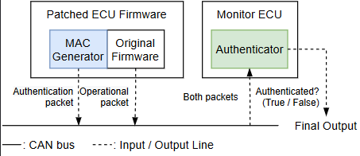

# Authenticator

An ECU application for BLAKE3 HMAC authentication.

```python
python authenticator.py
```

## Setup

### Install dependencies

[python-can](https://github.com/hardbyte/python-can) compatible devices or other implements are required.

```bash
pip install -r requirements.txt
```

### Build python interface for blake3

Configure [blake3/Makefile](https://github.com/purseclab/ShadowAuth/blob/main/authenticator/blake3/Makefile) for your environment.

Build blake3:
```bash
cd blake3
make
```

Althogh there is already [python interfaces for BLAKE3](https://github.com/oconnor663/blake3-py),
I wrote new one due to the compatibility issue.

### Configure network



* Connect total two ECUs: ShadowAuth-compatible ECU and monitoring ECU (this)
* Modify `can_ecu_map.json` by ECU-CAN ID map.  
The given file is a preset based on [rusEFI](https://github.com/rusefi/rusefi).
* Run